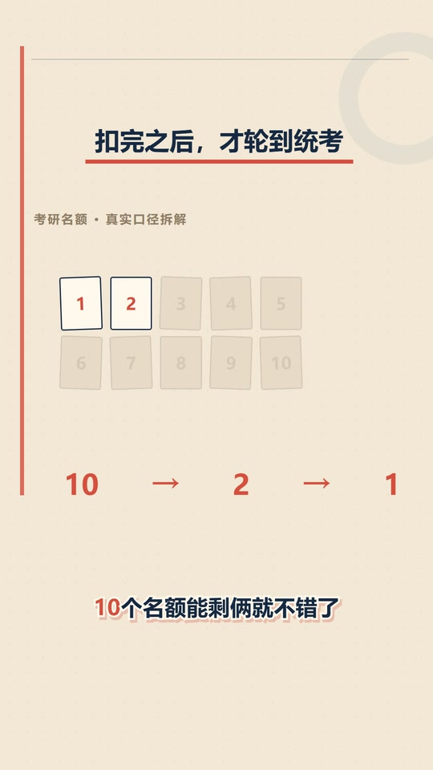
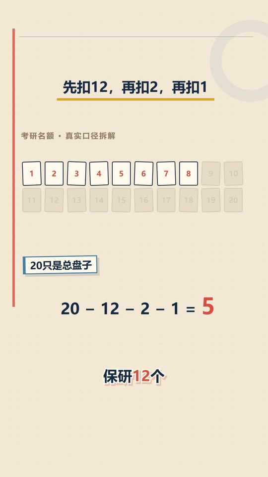
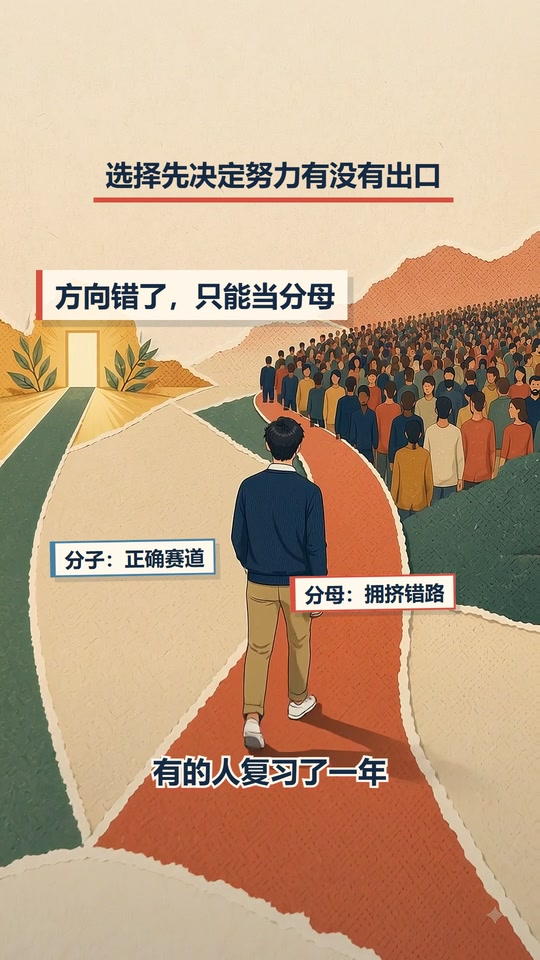
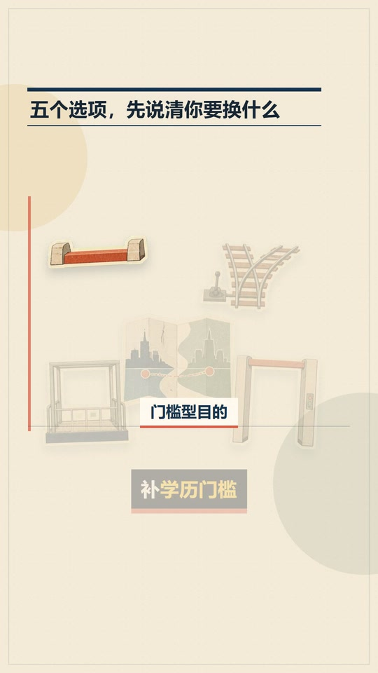
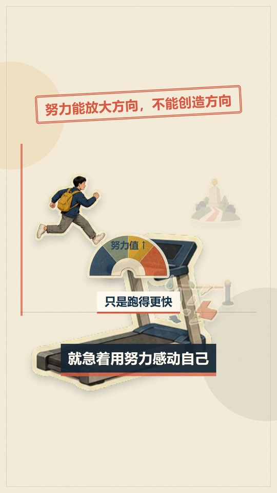

# 展示案例

这里的图片全部从已经发布、通过最终审核的编码母版抽取。没有把 Gate 2 概念图、生图参考图或后期重绘画面当作成片展示。

## 案例一：《考研统考名额》

这条片子的难点不是“招生名额很多”，而是必须让观众分清目录总数、推免、专项计划、方向、校区和真实统考名额。生成模型不负责计数，精确数字全部由本地组件控制。

| 画面 | 这张图解决什么 |
|:--:|:--|
|  | Flow 用于建立“目录数字不等于真实机会”的人物情境，字幕和中文解释仍由本地后期完成。 |
|  | `10 → 2 → 1` 使用本地确定性组件，数字不会因生成模型漂移。 |
|  | 把 `20 - 12 - 2 - 1 = 5` 落到画面，解释“总盘子”和“真实统考”不是一个口径。 |
|  | 整幅插画只在原边框内部轻微放大，保留人物、地图、学校和结果标签。 |
|  | Flow 承担“发现太晚”的有机动作，后期解释文字与字幕避开人物和书本。 |
|  | 用路径和人群表现“方向错了，只能当分母”，核心结果有稳定停留时间。 |

## 案例二：《如果说不清楚考研要解决什么，先别考》

这条片子最初的问题是画面太勤快：主构图切得快，气泡和票据没有文字，解释词复述字幕，小字不可读，声音与配乐也没有进入正式档案。最终版本没有重做一切，而是按修改域逐轮收束。

| 画面 | 这张图解决什么 |
|:--:|:--|
|  | 一个稳定主构图先建立问题，不急着为每句口播换新场景。 |
|  | Flow 负责购物车的有机动作，解释文字给出“看似划算，不代表值得购买”的判断。 |
|  | 多个目的在同一构图中依次聚焦，字幕变化不触发整套场景替换。 |
|  | 传送带和选择卡演示“把选择往后推”，解释文字不复述字幕。 |
|  | 字幕向中心安全区移动，但与指南针、人物和解释文字保持清楚分区。 |
|  | 跑步机把“努力能放大方向，不能创造方向”落成可辨认的结果状态。 |

## 案例边界

- 这里只展示最终画面，不提供完整视频、口播、Flow 原片或项目源码。
- 截图中的观点和数据属于对应成片语境，不能脱离上下文当作咨询结论。
- 案例画面版权归牧之远见所有，用于说明本开源 Skill 的实际制作效果。
